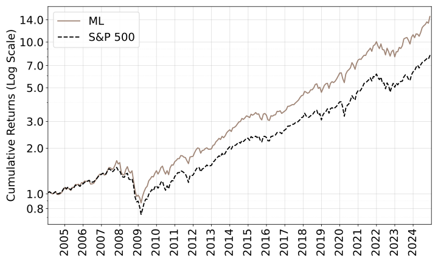

# Beating the S&P 500 — The Virtue of Transaction Costs (VoT)

Code repository for the paper:

**“Beating the S&P 500: The Virtue of Transaction Costs” (Feb 18, 2026)**

---

## Executive Summary

Machine learning (ML) return forecasts often look strong **gross**, but fail **net of transaction costs** in liquid large-cap universes.

This project shows:

> **ML forecasts remain economically valuable in active S&P 500 stocks when portfolio construction is transaction-cost-aware.**

Quadratic price impact does not merely reduce returns mechanically — it **regularises trading**, preventing forecast noise from being translated into excessive turnover.

---

## Key Idea

### The failure mode

Naive forecast → trade mappings (e.g. ranks/deciles):

- Ignore turnover
- Ignore liquidity
- Translate weak cross-sectional differences into aggressive reallocations
- Collapse net of costs

### The solution: Predict–Then–Optimise

A modular two-stage pipeline:

### 1️⃣ Predict (Forecast Returns)

One-month-ahead expected returns using:

- **XGBoost (XGB)**
- **Transformer (TF)**
- **Instrumented PCA (IPCA)**
- **Random Fourier Features (RFF)**

Forecasting is **fully separated** from portfolio optimisation.

### 2️⃣ Optimise (Cost-Aware Portfolio Construction)

Weights are chosen subject to:

- Long-only
- Fully invested
- Active S&P 500 constituents only
- Volatility benchmarking (market-like risk)
- Quadratic price-impact transaction costs
- Optional concentration limits

---

## Evaluation Setting (Deliberately Demanding)

| Dimension | Setting |
|------------|----------|
| Universe | Active S&P 500 constituents |
| Frequency | Monthly rebalancing |
| Sample | 2004–2024 |
| Benchmark | S&P 500 (SPY total return) |
| Performance | Net of transaction costs |

This avoids:

- Microcaps
- Illiquidity effects
- Leverage
- Shorting

---

## Core Mechanism: The Virtue of Transaction Costs (VoT)

Transaction costs enter the objective as:

$$
w_t
(\pi_t - G_{t-1}\pi_{t-1})^\top
\Lambda_t
(\pi_t - G_{t-1}\pi_{t-1})
$$

Because impact is quadratic:

- Costs scale with **trade size²**
- Larger AUM ⇒ stronger penalty
- Acts like an **endogenous Ridge penalty on trades**

### Main Result

> Optimising **as if costs are large** improves benchmark-relative performance.

Large assumed costs:
- Shrink noisy trades
- Reduce overtrading
- Improve Sharpe and Information ratios

Transaction costs become a **discipline mechanism**, not just an execution drag.

## Performance Highlight — IPCA (Best Performing Model)

All performance statistics are **annualised** (μ, σ, Sharpe, IR, α).

| Portfolio | μ | σ | Sharpe | TO | IR | MaxD | DCap | α |
|------------|------|------|--------|------|------|--------|------|------|
| **S&P 500** | 0.110 | 0.147 | 0.645 | • | 0.000 | -0.509 | 1.000 | • |
| **IPCA** | 0.142 | 0.158 | 0.802 | 0.054 | 0.512 | -0.473 | 0.973 | 0.031 |

### Notes

- **μ**: Annualised mean return  
- **σ**: Annualised volatility  
- **Sharpe**: Annualised Sharpe ratio  
- **IR**: Annualised Information Ratio (vs. S&P 500)  
- **α**: Annualised abnormal return (factor-adjusted)  
- **TO**: Average monthly turnover  
- **MaxD**: Maximum drawdown  
- **DCap**: Drawdown capture ratio  

IPCA delivers:

- Higher return  
- Similar volatility  
- Higher Sharpe ratio  
- Strong benchmark-relative performance (IR = 0.512)  
- Low turnover (5.4% per month)  
- Positive annualised alpha 

---

# Portfolio Construction

## Optimisation Problem

Each month, choose long-only weights:

$$
\begin{aligned}
\max_{\pi_t} \quad
& \hat{r}_{t+1}^\top \pi_t \\
&- w_t (\pi_t - G_{t-1}\pi_{t-1})^\top
\Lambda_t
(\pi_t - G_{t-1}\pi_{t-1})
\end{aligned}
$$

Subject to:

### Long-Only and Concentration Limit

$$
0 \le \pi_t \le \pi_{\max}
$$

### Fully Invested

$$
\mathbf{1}^\top \pi_t = 1
$$

### Volatility Benchmarking

$$
\sqrt{\pi_t^\top \Sigma_t \pi_t} \le \sigma_t^B
$$

---

## Variable Definitions

| Symbol | Meaning |
|--------|----------|
| $\pi_t$ | Portfolio weights |
| $\hat{r}_{t+1}$ | Predicted returns |
| $w_t$ | Wealth (AUM) |
| $G_{t-1}$ | Drift adjustment matrix |
| $\Lambda_t$ | Price impact (Kyle’s $\lambda$) |
| $\Sigma_t$ | Covariance matrix |
| $\sigma_t^B$ | S&P500 volatility (EWMA estimate) |
| $\pi_{\max}$ | Concentration limit |

---

## Implementation Details

### Constraint Handling

- **Softmax parameterisation**
  - Ensures long-only
  - Ensures fully invested

- **ReLU penalties**
  - Max weight violations
  - Variance constraint violations

### Transaction Costs

- Quadratic impact (Kyle λ)
- Costs applied to deviations from drifted baseline
- Scale with AUM

### Optimisation

- PyTorch
- Gradient ascent (Adam)

---

## Why This Works

Two layers of regularisation:

1. **ML shrinkage for return predictions** (early stopping / Ridge / tree regularisation)
2. **Transaction cost shrinkage for portfolio weights** 

The second layer filters economically insignificant trades.

---

# Repository Structure

### Data & Preprocessing

- `Data_Preprocessing.py`  
  Builds monthly signals dataset

- `Feature_Engineering.py`  
  Cross-sectional standardisation

- `SP500_Constituents.py`  
  Monthly investable universe

- `SPY_return.py`  
  Benchmark return series

- `Estimate Covariance Matrix.py`  
  Factor-based covariance estimation

---

### Return Forecasting

- `XGBoost.py`
- `Transformer.py`
- `IPCA.py`
- `RFF.py`

Each produces 1-month-ahead expected returns.

---

### Portfolio & Results

- `Portfolio_Optimiser.py`  
  Cost-aware constrained optimisation

- `Results.py`  
  Backtests, performance metrics, turnover, Sharpe, IR, drawdowns

- `General_Functions.py`  
  Shared utilities

---

# Conceptual Contribution

This repository demonstrates:

- ML forecasts contain real information in large-cap equities.
- The bottleneck is not prediction.
- The bottleneck is **implementation discipline**.
- Transaction costs provide an economically grounded regularisation device.

---

# Bottom Line

Transaction costs are not just friction.

They are a **regularisation tool** that converts ML forecasts into investable alpha in the S&P 500.
